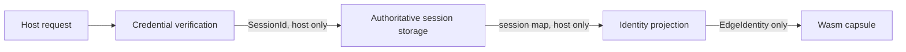

# ADR-0005: Host-authoritative edge identity

**Status:** Accepted

## Context

Edge execution must not turn a session cookie or a replicated cache into an
authentication authority. Authentication has three different reasons to
change and therefore must not be hidden in a backend plugin.

## Decision

Autumn separates three independent components:

1. **Credential verification** parses the configured cookie and verifies its
   signature against the current and previous signing keys.
2. **Authoritative session storage** decides whether that credential is live,
   expired, or revoked. Redis, DragonflyDB, and Valkey use the same Redis store
   adapter and limited `GET`, `SET` (with TTL), and `DEL` command surface.
3. **Identity projection** allow-lists and normalizes claims needed by the
   capsule. Custom projectors map application-specific authentication keys and
   roles without teaching a storage plugin about cookies.

The capsule receives only `EdgeIdentity`. Raw cookies, session IDs, signatures,
current or previous signing secrets, backend credentials/keys, and arbitrary
session data are host-only and never appear in that value or on the edge wire.

Missing or invalid authentication is an unauthenticated miss. Store/network
failure is a distinct typed infrastructure error. Both fall through to the
origin when identity is required; capsule code is not executed.

## Consequences

An authoritative store must provide read-after-write behavior appropriate to
immediate logout/revocation. An opportunistic cache cannot safely replace it:
cache misses and eviction are normal, while stale cache hits could preserve
revoked authority. Cross-region stores trade latency for consistency; deploy
the authority near verification or route identity-required misses to origin.
