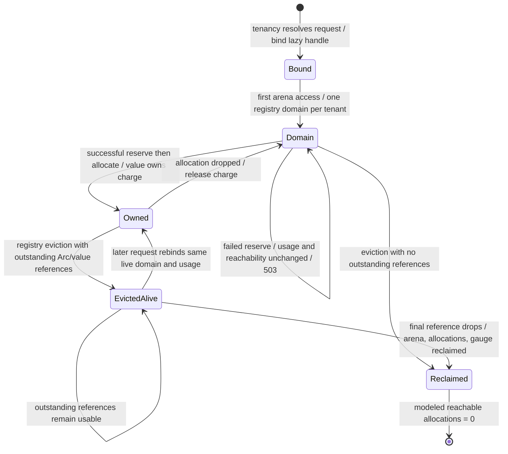

# ADR 0012: Cooperative tenant scratch-memory boundary

- **Status:** Accepted
- **Date:** 2026-08-20

## Context

Autumn forbids unsafe code. Stable safe Rust cannot transparently intercept
every allocation performed by application and third-party code, nor can an
ordinary library replace allocation for `Vec`, `String`, `Box`, futures,
database drivers, response bodies, TLS, or allocator metadata. Calling the old
byte counter hard memory isolation would therefore be false.

## Decision

The enforceable boundary is **cooperative tracked memory**. Each tenant ID maps
to exactly one resident accounting domain in the `AppState`-owned
`TenantCellRegistry`. `TenantArena` is the safe region facade. Its supported
owned allocation classes are fixed-size `TenantBytes` and `TenantString` plus
the cell-owned keyed byte scratch store. Their capacity/accounting ownership
cannot be separated: a successful allocation owns an RAII charge, and dropping
the value releases it. A finite quota admits an allocation only when the new
tracked total is at most the quota; a failed reservation changes neither usage
nor reachability. Quota/allocation failures map to HTTP 503.

`try_charge` remains a compatibility accounting primitive, but is only a
cooperative declaration and does not own the caller's allocation. It is not an
isolation mechanism. The following remain outside the boundary:

- bare Rust heap values (`Vec`, `String`, `Box`, collections, futures);
- request/response bodies and framework, database, TLS, cache, and plugin memory;
- thread/task stacks, allocator metadata, fragmentation, and size-class rounding;
- native/global allocations and allocations made before an arena call.

Thus Autumn explicitly rejects the claim that a tenant's RSS or arbitrary Rust
heap allocation is bounded. Hard isolation requires a process/container/VM or
a future allocator integration with a separately reviewed safety architecture.

## Lifecycle

Eviction removes only the registry reference. It does not invalidate an
in-flight request; final reclamation occurs only after every outstanding
reference and arena-owned value is dropped. A weak domain index prevents quota
reset across generations: if a new request for the same tenant arrives while an
evicted domain is still live, the registry rebinds that domain and its existing
usage instead of creating a zero-usage accounting domain.

## Verification and consequences

`verification/tenant_arena.rs` specifies and proves the accounting transition
spine: stable tenant/domain binding, finite-quota preservation, failed-reserve
non-mutation, and zero reachability after final teardown. Runtime tests cover
the observable allocation, concurrency, HTTP, eviction, and drop behavior.

The trade-off is explicit cooperation: supported scratch values are enforceably
owned and accounted, while application authors must not infer whole-process or
hard multi-tenant memory isolation.
