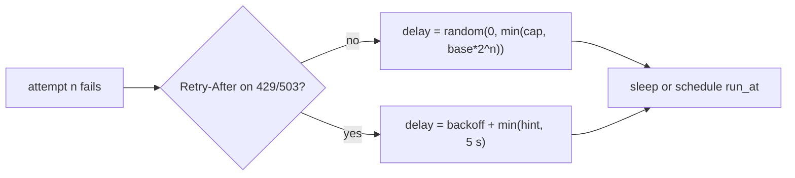

# ADR 0015: One Full-Jitter Backoff For Every Retry Path

- Status: Accepted
- Date: 2026-10-05
- Tags: resilience, retries, http-client, jobs, webhooks

## Context

Issue #3054. The HTTP client and the `postgres`, `redis` and `sqlite` job
backends retried at the exact delay `base * 2^n`. The durable backends had no
cap. Callers that failed together retried at the same instant. Only the
`local` backend had jitter (equal jitter, `[base/2, base]`), so development
and production retried differently. `RequestBuilder::retries(n)` also turned
on `POST` and `PATCH` retries with no `Idempotency-Key`.

## Decision

1. One module, `autumn_web::backoff`, computes every retry delay as full
   jitter: `random(0, min(cap, base * 2^n))`. The math saturates.
2. Jobs and `Client::from_state` draw from `AppState::entropy`, so a `Sim`
   seed replays the delays. A capsule recording wrapper is skipped for the
   client, because replay does not make those draws again. `Client::new()`
   uses OS entropy.
3. All four job backends and the HTTP client use it. The `local` backend
   changes from equal jitter to full jitter, so all backends agree. A claim
   recovered after its visibility timeout also gets the jitter. Postgres and
   SQLite recover many rows in one statement, so they draw it with the
   database's `random()`. Redis puts the job in its `delayed` set.
4. Caps are configuration: `[http.client] max_backoff_ms` (20 s) and
   `[jobs] max_backoff_ms` (1 h).
5. The HTTP client reads `Retry-After` on `429` and `503`. The wait is
   `backoff + min(hint, 5 s)`: in `[backoff, backoff + 5 s]`, never before a
   hint of up to 5 s, and still jittered.
6. `.retries(n)` sets the count only. `.retry_non_idempotent()` is the opt-in
   for `POST` and `PATCH`, and adds an `Idempotency-Key` (same value on each
   attempt) unless the caller set one.

## Consequences

- Positive: callers that fail together do not retry at the same instant. One
  tested helper. Seeded under `Sim`.
- Negative: full jitter can give a delay near 0 ms. A job with a very small
  `backoff_ms` can retry almost at once. `max_attempts` still bounds it.
- Breaking: code that relied on `.retries(n)` to retry a `POST` must add
  `.retry_non_idempotent()`. `RetryPolicy` has a new public field.
- Negative: a `Retry-After` above 5 s is cut to about 5 s, so a strict rate
  limiter can answer `429` again.
- Not changed (follow-up work): database transaction retries (`db.rs`, ±20%
  jitter), the commit-hook queue (`repository_commit_hooks.rs`), custom-domain
  issuance (`custom_domain.rs`) and the migrate start-up loop (`migrate.rs`).
  They keep their own backoff.
