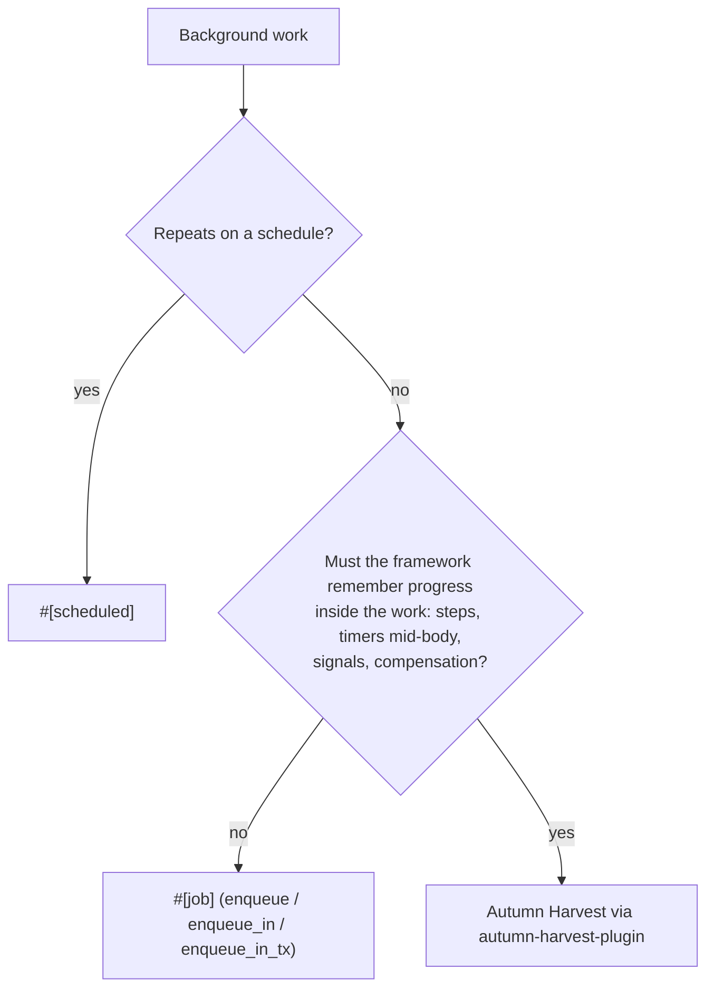

# ADR 0016: Durable Workflows Live In Harvest; Jobs Stay Lightweight

- Status: Accepted
- Date: 2026-10-07
- Deciders: Autumn maintainers
- Tags: jobs, workflows, harvest, plugins, boundaries

## Context

Issue #3070 proposed building durable workflows into `autumn-web`: DBOS-style
`#[workflow]` and `#[step]` macros, `autumn_workflows` and
`autumn_workflow_steps` checkpoint tables, a durable `ctx.sleep`, signals,
compensation handlers, a determinism lint, and admin pages to list, cancel and
retry workflows. Its premise was that durable workflows "are currently left to
Autumn Harvest, which is not in this workspace", so apps hand-roll sagas on top
of jobs.

The premise was wrong. Autumn Harvest is not a plan. It is a full durable
workflow engine with its own repository
([`autumn-foundation/autumn-harvest`](https://github.com/autumn-foundation/autumn-harvest))
and release train, and it plugs into Autumn through `autumn-harvest-plugin`.
Everything #3070 asked for already ships there:

| #3070 proposal | Where it already lives in Harvest |
| --- | --- |
| `#[workflow]` / `#[step]` macros | `autumn-harvest-macros`: `#[workflow]`, `#[activity]`, `#[dag]`, `#[signal]`, `#[query]`, `#[update]` |
| Step checkpoints, replay after a crash | Event-sourced workflow history with deterministic replay |
| `ctx.sleep(duration)` durable timer | `WorkflowContext::sleep` |
| `ctx.recv::<Signal>()` / `send_signal` | `wait_for_signal`, `send_signal` |
| Compensation handlers | `saga` module (`compensate`, `compensate_all`), `examples/saga-choreography` |
| Crash recovery, heartbeats, fencing | Activity heartbeats, timeouts and retry policies (Harvest ADR-0005) |
| Determinism lint | `autumn-harvest-verify`, a MIR-level determinism verifier for `#[workflow]` fns |
| `crash_at` simulation tests | Deterministic simulation testing (Harvest ADR-0004) |
| Admin list / inspect / cancel / retry | Management API, `harvest` CLI, MCP tools |
| "Ship the Harvest outbox (TD-008)" | `autumn_harvest_plugin::outbox::enqueue_workflow_start_outbox` |

The confusion came from this repository's own documents. ADR-0004 already put
"workflow history, timers and dead letters" under Harvest, but was still marked
*Proposed*. `docs/autumn-workflow-architecture.md` was the March 2026 design
draft, and it described Harvest's crates as new members of this workspace.
`TD-008` recorded a Harvest topology decision in Autumn's ADR folder, also
*Proposed*. Read together, they made a shipped engine look like an unbuilt
roadmap item.

Meanwhile the job system has grown: delayed enqueue, transactional enqueue
(`enqueue_in_tx`, `enqueue_on_conn`, `enqueue_after_commit`), priorities,
per-queue pools, uniqueness and concurrency limits, tracked progress, dead
letters, full-jitter backoff (ADR-0015), and the heartbeat and fencing work
under #3050. Each of those makes one unit of work more reliable. None of them
makes the framework remember a position *inside* that work. That line is the
one this ADR writes down, so the next roadmap pass does not propose a second
workflow engine again.

## Decision

### 1. Autumn core does not ship a workflow engine

`autumn-web`, `autumn-macros` and the other crates in this workspace will not
add any of the following. Each is a Harvest concern:

- `#[workflow]`, `#[step]`, `#[activity]` or similar macros that define a
  multi-step durable unit.
- Per-step checkpoint or history tables, or replay of a partially completed
  handler.
- A durable sleep or timer *inside* a handler body. (A delayed job is a
  durable timer *before* a handler, and stays in scope.)
- Signals, queries or updates sent to a running unit of work.
- Compensation or saga handlers.
- Determinism rules or determinism checking for handler bodies.
- Dependency graphs between jobs: "run B after A succeeds", batches with
  completion callbacks, fan-out/fan-in.

### 2. A job is one unit of work, delivered at least once

The job contract stays: a job has not run, is running, or has finished
(succeeded or dead-lettered). A retry starts the handler again from the top,
so a handler must be idempotent. Work that makes that contract more reliable
or more operable is in scope, for example:

- delayed and transactional enqueue;
- retries, backoff, dead letters and their retention;
- priorities, queues, worker pools and process roles;
- uniqueness, concurrency limits and cost-aware deferral;
- visibility timeouts, heartbeats, leases and fencing that recover a crashed
  claim;
- tracked progress of a single job, and admin views of jobs.

### 3. The boundary test

When a feature request sits near the line, ask:

> Does the framework have to remember *where inside the work* it got to?

If no, it can be a job feature. If yes, it belongs in Harvest.

### 4. Chaining stays in application code

A job may enqueue another job from its own body, including on the same
connection as its writes (`enqueue_on_conn`, `enqueue_after_commit`). That is
application code making a decision, and needs no framework support. The
framework does not grow a declarative way to say "after A, run B". The first
such feature invites the second (fan-in, then partial failure, then
compensation), and the end of that road is Harvest.

### 5. Harvest integrates through the plugin seam, in one direction

- Harvest plugs in through the `Plugin` trait (ADR-0005) as
  `autumn-harvest-plugin`. It depends on `autumn-web`. `autumn-web` never
  depends on Harvest.
- Examples and tests in this workspace do not depend on Harvest, so an
  `autumn-web` release never waits on a Harvest release.
- When an app write and a workflow start must commit together, the supported
  pattern is Harvest's transactional outbox: call
  `autumn_harvest_plugin::outbox::enqueue_workflow_start_outbox` on the same
  connection as the app transaction, and the plugin relays it to Harvest
  storage. This mirrors `enqueue_in_tx` for jobs.
- Autumn core keeps the seams Harvest consumes stable: `AppState`, the
  `Plugin` trait, the database pool and connection types, `MetricsSource`, and
  the MCP tool projection. A change that breaks one of those is a breaking
  change for Harvest and needs a migration note like any other.

### 6. Harvest's design documents live in Harvest

Harvest's architecture, roadmap and topology decisions are owned by the
Harvest repository. This repository keeps pointers, not copies:

- `docs/autumn-workflow-architecture.md` becomes a pointer to the Harvest
  repository and to this ADR.
- `TD-008` is superseded here. Its embedded / split / external topology ships
  in `autumn-harvest-plugin` (`HarvestMode`), and further changes to it are
  Harvest decisions.
- ADR-0004 is accepted. Its "Durable Async State" category is the decision
  this ADR elaborates.

## Consequences

### Positive

- One durable workflow engine, not two with different semantics, tables and
  admin surfaces.
- `autumn-web` does not carry workflow history tables, replay, or determinism
  rules in every app that only needs a background email.
- The job system has a written scope. A feature request can be checked against
  the boundary test instead of argued from scratch.
- Harvest keeps its own release cadence and its own verification depth
  (simulation, MIR verifier) without slowing `autumn-web` releases.

### Negative

- An app that needs one saga must adopt a second crate, its migrations and its
  configuration. There is no "small workflow" step between a job and Harvest.
- Harvest tracks `autumn-web` releases. A breaking change in a seam listed in
  decision 5 costs a coordinated Harvest release.
- Users must learn which tool to pick. The jobs guide's "Pick the right tool"
  table and the boundary test carry that.

### Risks

- A job feature that is a workflow feature in disguise. Mitigation: review it
  against the boundary test and decision 1's list.
- The pointers in this repository drift from Harvest's real API. Mitigation:
  link to the Harvest repository rather than restating its API here.

## Alternatives Considered

### 1. Build DBOS-style workflows into core (#3070)

Rejected. It duplicates a shipped engine, splits users between two workflow
models with different guarantees, and puts history tables, replay and
determinism rules into every Autumn app. Its own acceptance criteria (crash at
every await, durable sleep across restarts, compensation) are already tested
in Harvest.

### 2. Move Harvest into this workspace

Rejected. It couples the two release trains, and since Harvest depends on
`autumn-web`, an in-workspace Harvest invites `autumn-web` examples and tests
to depend on it, which is the circular release dependency the README warns
against.

### 3. A "workflow-lite" layer on jobs

For example, a memoized step helper or a durable sleep inside a job body.
Rejected. Each piece needs a checkpoint store, a replay rule and a determinism
contract, which together are a workflow engine. Shipping a partial one is the
"bolt on a weaker Harvest" outcome this ADR exists to prevent.

## References

- Issue #3070 (closed): in-app durable workflows proposal.
- Issue #3050: distributed resilience roadmap.
- ADR-0004: Externalize Distributed Runtime State.
- ADR-0005: Adopt a Plugin Trait for Autumn Integrations.
- ADR-0015: One Full-Jitter Backoff For Every Retry Path.
- TD-008: Harvest Topology Progression (superseded here).
- [`autumn-foundation/autumn-harvest`](https://github.com/autumn-foundation/autumn-harvest)
