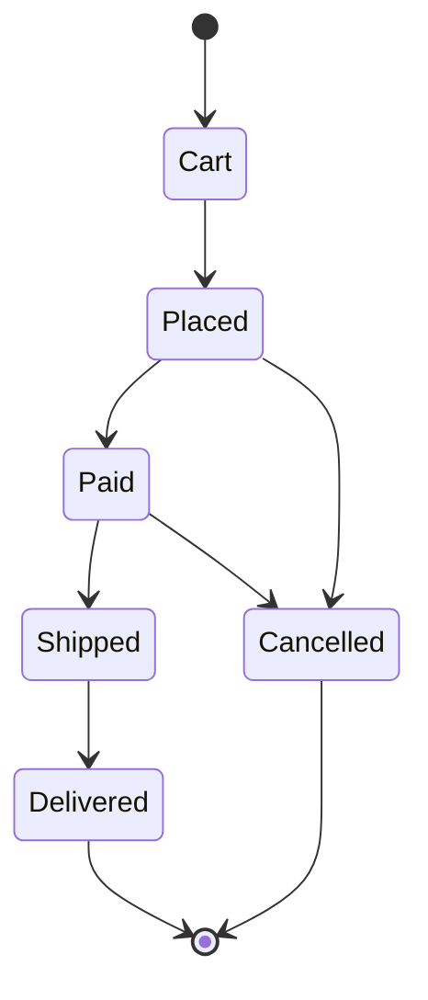

# Typed Lifecycles

Autumn's `#[lifecycle]` attribute turns a plain enum into a **typestate machine**
whose illegal transitions are a *compile* error. You declare the states, the
initial state, the terminal states, and every legal edge once, on the enum; the
macro generates a metadata surface plus a per-enum module of zero-cost marker
types where the only methods that exist are the transitions you declared. The
macro also walks the declared graph and refuses to compile a lifecycle that is
structurally unsound — a state nothing reaches, or a non-terminal state with no
path to a terminal. `autumn lifecycle check` re-proves the same properties
across a whole project and emits a machine-readable artifact for CI.

```rust
use autumn_web::lifecycle;

#[lifecycle(
    initial = Cart,
    terminal(Delivered, Cancelled),
    transitions(
        Cart -> Placed,
        Placed -> Paid,
        Placed -> Cancelled,
        Paid -> Shipped,
        Paid -> Cancelled,
        Shipped -> Delivered,
    )
)]
#[derive(Debug, Clone, Copy, PartialEq, Eq)]
pub enum OrderState {
    Cart,
    Placed,
    Paid,
    Shipped,
    Delivered,
    Cancelled,
}
```

---

## `#[lifecycle]` vs. `#[state_machine]`

Autumn ships two state-transition primitives that look similar but sit at
opposite ends of the soundness spectrum. Pick by *when* you want an illegal
transition to be caught.

| | `#[state_machine]` | `#[lifecycle]` |
|---|---|---|
| Shape | A field attribute on a `String` field of a `#[model]` | A standalone attribute on an `enum` |
| State representation | Runtime string (`"draft"`, `"published"`) | A distinct Rust type per state |
| Illegal transition | Rejected at **runtime** (`transition_status_to` returns a `400`) | Fails to **compile** — the method does not exist |
| Guards | Yes — `from -> to: "guard_method"` runs `&self -> bool` | No runtime guards (structural only) |
| Reachability / dead-ends | Not checked — dead states compile fine | Proven at **compile time**; re-proven project-wide by `autumn lifecycle check` |
| Persistence | Backed by a model column, versioned/audited with the record | In-memory typestate; no persisted instance |

Use `#[state_machine]` when the state is a **column on a persisted row** and the
rules are data-dependent (guards that read other fields, values that arrive from
untyped JSON/form input). Use `#[lifecycle]` when you want the *compiler* to make
an illegal transition unrepresentable in code — an orchestration step, a
protocol handshake, a wizard, a lifecycle you drive from typed Rust rather than
from a string column.

See also: [Declarative State Machines](state-machines.md) — the runtime-checked
`String`-field sibling of `#[lifecycle]`.

---

## Attribute syntax

`#[lifecycle(...)]` is applied to an `enum`. It takes three arguments:

```rust
#[lifecycle(
    initial = <Variant>,                 // required, exactly one
    terminal(<Variant>, <Variant>, ...), // required, one or more
    transitions(                          // required, one or more
        <From> -> <To>,
        <From> -> <To>,                   // trailing comma allowed
    )
)]
enum MyState { /* ... */ }
```

- **`initial = <Variant>`** — the single start state. Required, exactly one.
- **`terminal(<Variant>, ...)`** — one or more end states. Required, non-empty.
- **`transitions(<From> -> <To>, ...)`** — the legal edges, written with `->`.
  Required, non-empty. A trailing comma after the last edge is allowed.

The arguments are comma-separated and may appear in any order, though the
canonical order is `initial`, `terminal`, `transitions`. Each argument may
appear **at most once** — a duplicate `initial` / `terminal` / `transitions` is
a macro error.

Every variant named in `initial`, `terminal`, or a transition endpoint must be a
real variant of the enum. A name that is not a declared variant is a compile
error that names the offending identifier — and because the generated code
references `MyState::<Variant>` directly, a typo'd endpoint fails to compile even
independently of the macro's own validation. A duplicate edge (`A -> B` listed
twice) is also a macro error.

The macro emits your enum **verbatim** (keeping your remaining attributes, such
as `#[derive(...)]`) and appends the generated items after it. On a validation
error it still re-emits the enum plus a `compile_error!`, so unrelated references
to the enum type do not cascade into a wall of errors.

---

## What it generates

For an enum `OrderState`, `#[lifecycle]` generates two things: a metadata `impl`
on the enum, and a typestate module named after the enum in `snake_case`
(`OrderState` → `order_state`).

### 1. Metadata consts and `can_transition_to`

```rust
impl OrderState {
    pub const LIFECYCLE_INITIAL: OrderState = OrderState::Cart;
    pub const LIFECYCLE_TERMINALS: &'static [OrderState] =
        &[OrderState::Delivered, OrderState::Cancelled];
    pub const LIFECYCLE_STATES: &'static [OrderState] = &[
        OrderState::Cart, OrderState::Placed, OrderState::Paid,
        OrderState::Shipped, OrderState::Delivered, OrderState::Cancelled,
    ];
    pub const LIFECYCLE_TRANSITIONS: &'static [(OrderState, OrderState)] = &[
        (OrderState::Cart, OrderState::Placed),
        (OrderState::Placed, OrderState::Paid),
        (OrderState::Placed, OrderState::Cancelled),
        (OrderState::Paid, OrderState::Shipped),
        (OrderState::Paid, OrderState::Cancelled),
        (OrderState::Shipped, OrderState::Delivered),
    ];

    pub fn can_transition_to(&self, to: &OrderState) -> bool { /* ... */ }
}
```

| Item | Type | Contents |
|------|------|----------|
| `LIFECYCLE_INITIAL` | `OrderState` | The declared initial state |
| `LIFECYCLE_TERMINALS` | `&'static [OrderState]` | Terminal states, in **attribute** order |
| `LIFECYCLE_STATES` | `&'static [OrderState]` | All variants, in **enum-declaration** order |
| `LIFECYCLE_TRANSITIONS` | `&'static [(OrderState, OrderState)]` | `(from, to)` edges, in **attribute** order |
| `can_transition_to` | `fn(&self, to: &OrderState) -> bool` | `true` iff `(self, to)` is a declared edge |

`can_transition_to` matches on references, so the enum does **not** need to be
`Copy`. These consts are the runtime-reflection surface — build UI, API
metadata, or a diagram from them just as you would from
`Order::__AUTUMN_SM_STATUS_TRANSITIONS` in `#[state_machine]`.

### 2. The typestate module `Machine<S>`

The macro emits a module named `snake_case(EnumIdent)` containing:

- **One marker type per state** — the variant name verbatim (`Cart`, `Placed`,
  …). Each carries `#[allow(non_snake_case)]`.
- **A sealed `State` trait** implemented for every marker, exposing
  `const NAME: &'static str` (the variant name) and
  `const VALUE: OrderState` (the corresponding enum value). The trait is
  sealed, so no downstream code can add a spurious state.
- **`Machine<S: State>`** — a zero-sized (`PhantomData`) handle parameterised by
  the current state marker.
- **`Machine::<Initial>::start()`** — a constructor that exists **only** for the
  initial state's marker.
- **`Machine::<S>::current(&self) -> OrderState`** — reads the enum value of the
  current state, available on every state.
- **One consuming `to_<target>()` method per declared edge**, grouped by source
  state. The method name is `to_` + `snake_case(target_variant)`
  (target `Placed` → `to_placed`, target `InReview` → `to_in_review`). Each
  consumes `self` and returns `Machine<Target>`.

```rust
pub mod order_state {
    pub struct Cart; pub struct Placed; pub struct Paid;
    pub struct Shipped; pub struct Delivered; pub struct Cancelled;

    pub trait State { const NAME: &'static str; const VALUE: super::OrderState; }
    // ... sealed impls for each marker ...

    pub struct Machine<S: State> { /* PhantomData<S> */ }

    impl Machine<Cart> {                 // start() ONLY on the initial state
        pub fn start() -> Machine<Cart> { /* ... */ }
    }
    impl<S: State> Machine<S> {
        pub fn current(&self) -> super::OrderState { S::VALUE }
    }

    impl Machine<Cart>    { pub fn to_placed(self)    -> Machine<Placed>    { /* */ } }
    impl Machine<Placed>  { pub fn to_paid(self)      -> Machine<Paid>      { /* */ }
                            pub fn to_cancelled(self) -> Machine<Cancelled> { /* */ } }
    impl Machine<Paid>    { pub fn to_shipped(self)   -> Machine<Shipped>   { /* */ }
                            pub fn to_cancelled(self) -> Machine<Cancelled> { /* */ } }
    impl Machine<Shipped> { pub fn to_delivered(self) -> Machine<Delivered> { /* */ } }

    // Delivered and Cancelled are terminal: no impl block, no outgoing methods.
}
```

Because a terminal state is the source of no declared edge, its marker gets **no
`to_*` methods at all** — attempting a transition out of a terminal state is a
compile error, not a runtime check.

---

## Worked example: an order lifecycle

Using the `OrderState` lifecycle from the top of this page, here is a function
that drives an order from `Cart` all the way to `Delivered` entirely through the
typestate API:

```rust
use crate::order_state;

fn fulfil_happy_path() -> OrderState {
    let order = order_state::Machine::start() // Machine<Cart> — start() lives here
        .to_placed()                          // Machine<Placed>
        .to_paid()                            // Machine<Paid>
        .to_shipped()                         // Machine<Shipped>
        .to_delivered();                      // Machine<Delivered>

    order.current() // OrderState::Delivered
}
```

Each `to_*` call **consumes** the previous `Machine<S>` and returns a
`Machine<Target>`, so the type of the value tracks the current state at every
step. There is no way to hold a stale handle to a superseded state.

### What does *not* compile

The whole point of `#[lifecycle]` is that the illegal moves are not merely
rejected — they *do not exist*:

```rust
// ❌ Compile error: no method `to_shipped` on `Machine<Cart>`.
//    Cart's only outgoing edge is `to_placed`; you cannot skip to Shipped.
let bad = order_state::Machine::start().to_shipped();

// ❌ Compile error: no function `start` for `Machine<Placed>`.
//    start() exists ONLY on the initial state (Cart); you cannot begin midway.
let bad = order_state::Machine::<order_state::Placed>::start();

// ❌ Compile error: no method `to_cancelled` on `Machine<Delivered>`.
//    Delivered is terminal — it is the source of no edge, so it has NO
//    outgoing methods. The lifecycle cannot continue past a terminal state.
let done = order_state::Machine::start()
    .to_placed().to_paid().to_shipped().to_delivered();
let bad = done.to_cancelled();
```

A branch that is legal, on the other hand, type-checks cleanly — `Placed` and
`Paid` both declare a `to_cancelled()` edge, so cancelling from either state is
allowed:

```rust
fn cancel_from_placed() -> OrderState {
    order_state::Machine::start()
        .to_placed()
        .to_cancelled()   // Machine<Cancelled>
        .current()        // OrderState::Cancelled
}
```

---

## The build-time soundness proof

Each generated `to_*` method knows only its own edge, so the typestate cannot
see the graph as a whole. The macro walks the declared graph as well: a
structurally unsound lifecycle **does not compile**.

It proves five properties:

1. **Reachability** — every variant is reachable from the initial state (no
   orphan states).
2. **Liveness (no dead-ends)** — every reachable non-terminal variant can reach
   at least one terminal state. A cycle that never leads to a terminal fails
   this too, even though every state in it has an outgoing edge.
3. **Endpoint existence** — the initial state, every terminal, and every
   transition endpoint is a declared variant.
4. **Terminal has no exit** — a declared terminal state is the source of no
   transition. A "movable terminal" is not terminal.
5. **No duplicate edge** — the same `From -> To` is declared at most once.

Properties 1 and 2 report every offending variant, each as its own diagnostic
spanned at the variant, so `cargo` underlines the state to fix. A state that is
both unreachable and exit-less is reported once, as unreachable: reachability is
the root cause. Properties 3 to 5 stop at the first violation and are spanned in
the attribute, where the bad name is written.

### An unreachable state

`Refunded` is a variant no transition targets, so no order can ever be in it
([`autumn/tests/compile-fail/lifecycle_unreachable_state.rs`](../../autumn/tests/compile-fail/lifecycle_unreachable_state.rs)):

```rust
#[lifecycle(
    initial = Pending,
    terminal(Delivered),
    transitions(
        Pending -> Paid,
        Paid -> Delivered,
    )
)]
pub enum OrderState {
    Pending,
    Paid,
    Refunded,   // ❌ nothing transitions into it
    Delivered,
}
```

```text
error: state `Refunded` is unreachable from initial state `Pending` of lifecycle `OrderState` — add a transition into it, or remove the variant
  --> tests/compile-fail/lifecycle_unreachable_state.rs:19:5
   |
19 |     Refunded,
   |     ^^^^^^^^
```

### A non-terminal dead-end

`OnHold` can be entered but never left, so an order that reaches it is stuck
([`autumn/tests/compile-fail/lifecycle_dead_end_state.rs`](../../autumn/tests/compile-fail/lifecycle_dead_end_state.rs)):

```rust
#[lifecycle(
    initial = Pending,
    terminal(Delivered),
    transitions(
        Pending -> OnHold,
        Pending -> Paid,
        Paid -> Delivered,
    )
)]
pub enum OrderState {
    Pending,
    OnHold,     // ❌ no outgoing transition, and not terminal
    Paid,
    Delivered,
}
```

```text
error: state `OnHold` is a non-terminal dead-end of lifecycle `OrderState`: no declared transition path reaches a terminal state — add an outgoing transition, or declare it terminal
  --> tests/compile-fail/lifecycle_dead_end_state.rs:19:5
   |
19 |     OnHold,
   |     ^^^^^^
```

A sound lifecycle compiles clean — see
[`autumn/tests/compile-pass/lifecycle_valid.rs`](../../autumn/tests/compile-pass/lifecycle_valid.rs),
and [`examples/invoice`](../../examples/invoice) for the same thing in a
runnable app: `InvoiceState` declares `Draft → Issued → Paid`, with `Void` as a
second terminal, and drives it through the generated typestate.

---

## The project-wide gate: `autumn lifecycle check`

The compile-time proof covers every lifecycle the compiler builds. `autumn
lifecycle check` proves the same five properties by *scanning source*, which
adds two things the macro cannot: one report over a whole workspace without a
build, and a machine-readable artifact for CI.

```bash
autumn lifecycle check                 # check lifecycles in the current crate
autumn lifecycle check ./crates/app    # explicit project path (a positional)
autumn lifecycle check --format json   # machine-readable output for tooling
```

It exits non-zero on any violation or unparseable attribute, naming the
offending state(s).

### As a CI gate

Run it alongside `fmt`/`clippy` so a broken lifecycle is reported by name even
in a job that does not build the crate:

```yaml
# .github/workflows/ci.yml
- name: Lifecycle soundness
  run: autumn lifecycle check
```

### Sample failing output

Given a broken order lifecycle — a `Refunded` state no edge targets, and a `Paid`
state whose only outgoing edge was removed — `autumn lifecycle check` reports:

```text
autumn lifecycle check
  scanned 1 lifecycle(s) across 1 .rs file(s)

  lifecycle 'OrderState' (5 state(s))
    initial:   Cart
    terminals: Delivered
    violations:
      [reachability] state 'Refunded' is unreachable from initial state 'Cart'
      [dead-end] state 'Paid' is a non-terminal dead-end (cannot reach any terminal state)

  summary: 1 lifecycle(s), 2 violation(s), 0 parse error(s)
Result: FAIL — fix the lifecycle violations above.
```

The `--format json` form emits the same findings as structured data, and doubles
as the lifecycle-graph artifact — it carries the declared states, initial state,
terminals and transitions alongside the violations:

```json
{
  "files_scanned": 1,
  "lifecycles": [
    {
      "name": "OrderState",
      "states": [
        "Cart",
        "Placed",
        "Paid",
        "Delivered",
        "Refunded"
      ],
      "initial": "Cart",
      "terminals": [
        "Delivered"
      ],
      "transitions": [
        [
          "Cart",
          "Placed"
        ],
        [
          "Placed",
          "Paid"
        ],
        [
          "Placed",
          "Delivered"
        ]
      ],
      "violations": [
        {
          "kind": "reachability",
          "states": [
            "Refunded"
          ],
          "message": "state 'Refunded' is unreachable from initial state 'Cart'"
        },
        {
          "kind": "dead-end",
          "states": [
            "Paid"
          ],
          "message": "state 'Paid' is a non-terminal dead-end (cannot reach any terminal state)"
        }
      ]
    }
  ],
  "errors": []
}
```

A sound lifecycle prints `Result: PASS` and exits `0`.

> **Scanner limits.** `lifecycle check` reads source rather than resolving it, so
> it recognizes `#[lifecycle(...)]`, a qualified `#[autumn_web::lifecycle(...)]`,
> and a *same-file* alias (`use autumn_web::lifecycle as lc; #[lc(...)]`) — but
> not an alias introduced in another file or laundered through a glob re-export
> (tracked in #1925). A lifecycle it skips is still proven by the compiler; only
> its entry in the report and the artifact is missing.

---

## The lifecycle diagram artifact

`autumn lifecycle diagram` renders a lifecycle's state graph as a diagram you can
drop into docs, a PR description, or a design review:

```bash
autumn lifecycle diagram --format mermaid   # Mermaid stateDiagram-v2 (default)
autumn lifecycle diagram --format dot       # Graphviz DOT
```

For the `OrderState` lifecycle it emits a `stateDiagram-v2` like this:



The `[*] -->` edge marks the initial state; edges into `[*]` mark the declared
terminals. The `--format dot` output is the same graph in Graphviz syntax for
`dot`-based pipelines.

---

## Constraints / not yet covered

`#[lifecycle]` deliberately proves *structural* soundness only. Being honest about
the edges of the current slice:

- **No guard satisfiability or bounded model checking.** The proof reasons about
  the transition *graph*. It does not model data-dependent conditions, so it
  cannot tell you whether a guarded path is *actually* traversable at runtime.
  (Lifecycles have no runtime guards at all; if you need data-dependent guards,
  use [`#[state_machine]`](state-machines.md).)
- **No concurrency or hierarchical statecharts.** There are no parallel/AND
  regions, nested/composite states, or orthogonal regions — a lifecycle is a
  single flat state graph with one active state at a time.
- **No runtime instance persistence or history.** `Machine<S>` is an in-memory,
  zero-sized typestate handle; the macro does not persist an instance, record a
  transition log, or track history. For a persisted, audited lifecycle on a
  stored row, use a `#[state_machine]` field together with
  [Version History](version-history.md) / the audit trail.
- **Structural properties only.** The proof covers reachability, dead-ends,
  endpoint existence and terminal exits over the declared graph — not whether a
  path is *taken* in practice, and not the runtime data behind it.
- **One entry point.** Reachability is measured from `initial`, the only state
  `Machine::start()` exists on. A lifecycle bound to a persisted column with
  `#[state_machine(lifecycle = <Enum>)]` can have a second entry point, because
  a row can be *created* in any state — an `Imported` or `Migrated` value no
  edge targets reads as unreachable and fails the build. Give it an edge from
  `initial`, or declare that field's table inline with
  `#[state_machine(transitions(...))]`, which applies no reachability rule.

---

## See also

- [Declarative State Machines](state-machines.md) — the runtime-checked
  `String`-field sibling; use it for persisted, guard-driven, data-dependent
  state on a model.
- [Macro Transparency](macro-transparency.md) — how to inspect what Autumn's
  macros generate with `cargo expand`.
- [Version History](version-history.md) — persisted transition history and audit
  trail for model-backed state.
- [Transition effects](transition-effects.md) — per-edge `on` / `on_commit` side
  effects on `#[state_machine]` transitions.
