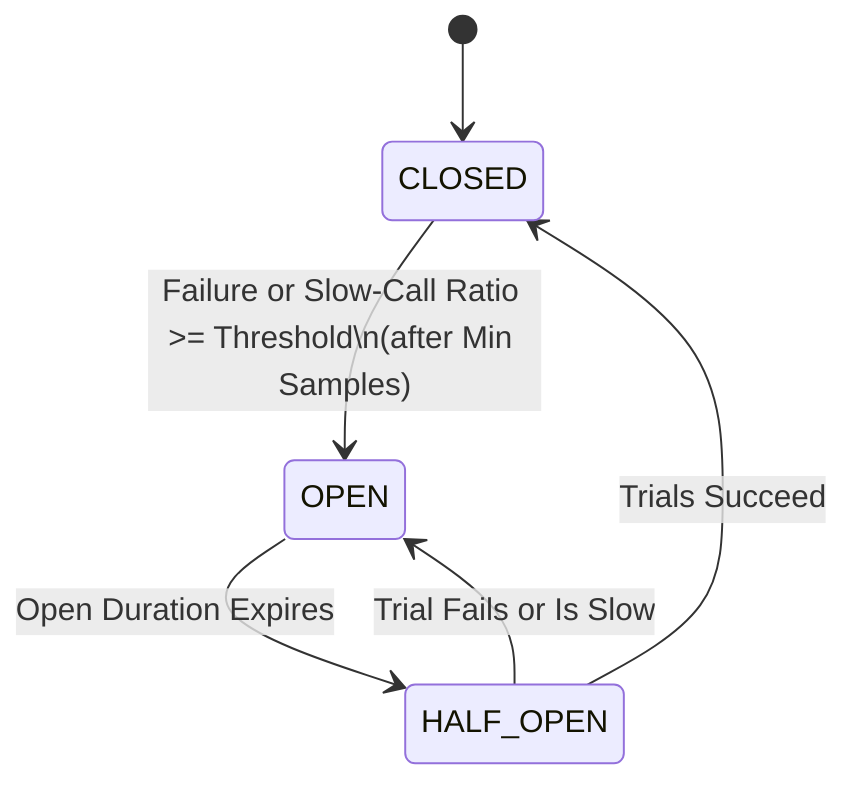

# Resilience & Outbound Circuit Breakers

Autumn provides a first-class `CircuitBreaker` resilience policy for outbound dependencies (HTTP clients, background jobs, and SMTP mailers) to protect the application from cascading failures during downstream outages.

---

## Core Concepts

A circuit breaker wraps outbound calls and tracks their success/failure ratio. It operates as a state machine with three states:



- **CLOSED**: Requests pass through normally. The breaker counts successes, failures and slow calls in a sample window.
- **OPEN**: Requests fail fast immediately with a `503 Service Unavailable` error (`ClientError::CircuitBreakerOpen` for HTTP, `MailError::RuntimeUnavailable` for mailers, etc.) without contacting the remote dependency.
- **HALF_OPEN**: A limited number of trial requests are sent. If all trials succeed, the circuit closes again. If a trial fails or is slow, the circuit opens again immediately.

### Slow calls

A call is slow when it takes `slow_call_duration_threshold_ms` or longer. A
slow call can succeed. The breaker opens when the slow-call ratio in the
window is `slow_call_rate_threshold` or more. This catches a dependency that
becomes slow but does not fail.

### Cancelled calls

A call can stop before it completes. For example, a request timeout drops it.
The breaker then counts it as follows:

- Cancelled before the slow-call threshold: the breaker counts nothing. The
  caller left, and the dependency was not slow.
- Cancelled at or after the threshold: the breaker counts a slow call. Set
  `cancelled_call_outcome = "failure"` to count a failed slow call instead.

Set `slow_call_duration_threshold_ms` below
`server.timeouts.request_timeout_ms`. If you do not, the request timeout
cancels a slow call before the breaker can see it as slow.

A call that started before a state change does not change the new state.
For example, a slow call that started before the breaker opened is not a
half-open trial.

### Sample window

The window is a ring of 10 buckets. Each bucket holds three counters (calls,
failures, slow calls) for one tenth of `sample_window_secs`. Memory per
breaker is constant at all request rates. The window holds the calls of the
current bucket and the 9 buckets before it. Thus a call stays in the window
for between 9/10 and 10/10 of `sample_window_secs`. A change to
`sample_window_secs` at runtime keeps the counts. They move into the current
bucket.

### Scope

Each process keeps its own breakers. Replicas do not share breaker state. One
replica can open its breaker for a host while another replica keeps it
closed.

---

## Configuration

Circuit breakers are configured in `autumn.toml` under the `[resilience.circuit_breaker]` section. You can set global defaults and define per-host overrides.

```toml
# autumn.toml
[resilience.circuit_breaker.defaults]
failure_ratio_threshold = 0.5    # Trip when >= 50% of calls fail (default: 0.5)
sample_window_secs      = 10     # Track last 10 seconds of traffic (default: 10)
minimum_sample_count    = 10     # Require at least 10 calls to trip (default: 10)
open_duration_secs      = 60     # Keep circuit open for 60 seconds (default: 60)
half_open_trial_count   = 3      # Run 3 trial requests in Half-Open (default: 3)
slow_call_duration_threshold_ms = 60000  # A call of 60 s or more is slow; 0 turns this off (default: 60000)
slow_call_rate_threshold = 1.0   # Open when all calls are slow (default: 1.0)
cancelled_call_outcome  = "slow" # A slow cancelled call counts as "slow" or "failure" (default: "slow")

# Per-host overrides for outbound HTTP clients
[resilience.circuit_breaker.hosts."api.stripe.com"]
failure_ratio_threshold = 0.3
minimum_sample_count    = 5
open_duration_secs      = 30
slow_call_duration_threshold_ms = 5000
slow_call_rate_threshold = 0.5

[resilience.circuit_breaker.hosts."api.sendgrid.com"]
open_duration_secs      = 10
```

Environment variables override the defaults. Examples:
`AUTUMN_RESILIENCE__CIRCUIT_BREAKER__DEFAULTS__SLOW_CALL_DURATION_THRESHOLD_MS`,
`AUTUMN_RESILIENCE__CIRCUIT_BREAKER__DEFAULTS__SLOW_CALL_RATE_THRESHOLD` and
`AUTUMN_RESILIENCE__CIRCUIT_BREAKER__DEFAULTS__CANCELLED_CALL_OUTCOME`.

---

## Integrations

### Outbound HTTP Client
The outbound [Client](file:///c:/Users/markm/autumn/autumn/src/http_client.rs) automatically attaches a circuit breaker keyed by target host to every outgoing request.
- **Successes**: Any HTTP response with status `< 500`.
- **Failures**: Any network timeout, connection error, or HTTP status `>= 500`.
- **Duration**: The time of the full `send`. Retries, back-off and
  `Retry-After` waits are included.

### Background Jobs
All background job enqueues (to Redis or PostgreSQL durable queues) in [JobClient](file:///c:/Users/markm/autumn/autumn/src/job.rs) are wrapped in a circuit breaker named `"job_queue"`. If the queue store experiences an outage, subsequent enqueue calls fail fast, preventing thread starvation.

### SMTP Mailer
Outgoing SMTP transport sends in [SmtpTransport](file:///c:/Users/markm/autumn/autumn/src/mail.rs) are wrapped in a circuit breaker named `"smtp_mailer"`. If the mail server goes down, mail sends fail fast immediately.

---

## Actuator Visibility

### Breaker State Endpoint
The `GET <actuator-prefix>/circuitbreakers` endpoint returns the current state of all active breakers.

- **Detailed Mode** (`health.detailed = true`):
  ```json
  [
    {
      "name": "api.stripe.com",
      "state": "CLOSED",
      "failure_ratio": 0.1,
      "slow_call_ratio": 0.0,
      "failure_ratio_threshold": 0.3,
      "sample_window_secs": 10,
      "minimum_sample_count": 5,
      "open_duration_secs": 30,
      "half_open_trial_count": 3,
      "slow_call_duration_threshold_ms": 5000,
      "slow_call_rate_threshold": 0.5,
      "cancelled_call_outcome": "slow"
    }
  ]
  ```
  `slow_call_duration_threshold_ms` is absent when slow-call detection is off.
- **Undetailed Mode** (`health.detailed = false` in production):
  ```json
  [
    {
      "name": "api.stripe.com",
      "state": "CLOSED",
      "failure_ratio": 0.1,
      "slow_call_ratio": 0.0
    }
  ]
  ```

### Health Integration & Downstream Outage Pattern
Every circuit breaker exposes its state as a `HealthIndicator` mapped under `components.circuit_breaker.<name>` on the `/actuator/health` endpoint. Its details include `failure_ratio` and `slow_call_ratio`.

To support the **Downstream Outage Pattern**, breaker health indicators are registered in the `HealthOnly` group:
- While a breaker is `OPEN`, `/actuator/health` returns `503 Service Unavailable` and displays status `DOWN` for that circuit.
- Crucially, the readiness probe endpoints `/health` and `/ready` remain `UP` (`200 OK`). This prevents Kubernetes from killing or removing the application replica from the load balancer pool simply because a third-party dependency (like Stripe or SendGrid) is down.

---

## Telemetry & Logging

Circuit state transitions are instrumented with the `tracing` ecosystem. Every transition emits a structured tracing event with attributes:
- `circuit.name`: The key of the circuit breaker (e.g. host name, `"job_queue"`, or `"smtp_mailer"`).
- `circuit.state`: The target state (`CLOSED`, `OPEN`, or `HALF_OPEN`).
- `circuit.failure_ratio`: The failure ratio that triggered the transition.
- `circuit.slow_call_ratio`: The slow-call ratio that triggered the transition.

Example transition log:
```
INFO circuit_breaker: Transitioned to OPEN circuit.name="api.stripe.com" circuit.state="OPEN" circuit.failure_ratio=0.6 circuit.slow_call_ratio=0.0
```

### Metrics

`/actuator/prometheus` shows two families for each breaker in the process
registry. Each series has a `version` and a `name` label:

| Family | Type | Value |
| --- | --- | --- |
| `autumn_circuit_breaker_slow_calls_total` | counter | Slow calls since the breaker was made. Cancelled slow calls are included. |
| `autumn_circuit_breaker_slow_call_ratio` | gauge | The slow-call ratio in the current window. |

The families are absent until the process creates its first breaker. The
HTTP client makes one breaker for each target host. Many hosts give many
series.

---

## Overload Protection & Load Shedding

Circuit breakers protect against a *downstream* dependency failing. Rate
limiting protects against a *greedy client*. Neither protects against the
*process itself* running out of capacity — a traffic spike, a slow query, or
a GC stall that causes admitted requests to pile up faster than they
complete. Left unbounded, that pile-up climbs RSS until the process is
OOM-killed: a full blackout that drops every in-flight request at once.

Autumn's answer is admission control: a single config knob caps concurrent
in-flight requests, and the excess is shed immediately with a `503 Service
Unavailable` + `Retry-After` — a brownout instead of a blackout.

```toml
# autumn.toml
[server]
max_concurrent_requests = 256   # prod default: pool size × 32, at least 256; 0 = off
```

Override at runtime with `AUTUMN_SERVER__MAX_CONCURRENT_REQUESTS`. A
reasonable starting point is the number of worker threads times a small
multiple (2-4x); tune based on the observed `autumn_requests_shed_total`
counter (exposed at `/actuator/prometheus`) and per-route latency.

Key properties:

- **Disabled by default.** `None`/`0` preserves today's unlimited behavior —
  no existing application silently changes throughput.
- **Before the handler runs.** A shed request never reaches your handler or
  has its body read; the `503` is returned immediately.
- **Probes are never shed.** `/health`, `/live`, `/ready`, `/startup`, and
  the whole actuator prefix always pass through, so a merely-busy replica is
  never killed by its orchestrator.
- **Composes with graceful shutdown.** The admission counter is independent
  of the shutdown-drain accounting, so shedding never double-counts,
  deadlocks, or extends the drain budget.
- **Observable.** Every shed request increments `autumn_requests_shed_total`
  and is access-logged with `status = 503` like any other response.

See [ADR 0009](../adr/0009-adopt-overload-protection-load-shedding.md) for
the full design rationale and how this differs from rate limiting and
per-request timeouts.

### Adaptive limit

A static ceiling is correct for one latency only. When a dependency slows
down, it admits too much work. Set `mode = "adaptive"` to let the limit follow
measured latency:

```toml
[server.admission]
mode = "adaptive"          # "static" (default) or "adaptive"
algorithm = "gradient2"    # "gradient2" (default), "vegas" or "aimd"
min_limit = 8
initial_limit = 20
# max_limit defaults to the static ceiling, else 1000.
```

- `gradient2` compares the latest RTT with a long-term average. A window with
  a drop (a `504` or a cancel at the request deadline) backs the limit off.
  After a long latency increase, its limit can stay low for minutes.
- `vegas` estimates the queue from the lowest RTT seen. It finds the new
  capacity faster.
- `aimd` backs off by 10% on a `504`, on a cancel at the request deadline,
  or on an RTT above `latency_threshold_ms` (default 1000). It adds 1 when a
  request used at least half the limit.

The limiter ignores responses whose latency does not show capacity: `4xx`,
`503`, routes with `timeout = "off"`, and requests that the client cancels.
The `autumn_admission_limit` gauge shows the current limit. Probes stay
exempt.

### Criticality

Mark a route with its class. Under overload, the server rejects `sheddable`
routes first and `critical` routes last:

```rust,ignore
#[get("/reports/export", criticality = "sheddable")]
async fn export() -> &'static str { "..." }

#[post("/checkout", criticality = "critical")]
async fn checkout() -> &'static str { "..." }
```

Each class can fill a share of the limit. `critical` always gets the full
limit:

```toml
[server.admission.partitions]
default = 1.0     # set below 1.0 to keep headroom for `critical`
sheddable = 0.5
```

The defaults change nothing for routes without a criticality. The
`autumn_admission_shed_total{criticality="..."}` counter shows what was shed.

The HTTP client sends the class downstream in `X-Autumn-Criticality` when it
is not `default`. A server reads that header only when
`trust_criticality_header = true`. Set it only when you trust all callers, or
when an edge proxy removes or sets the header. If you do not, a public client
can set its requests to `critical`. The `/mcp` endpoint admits a tool call as
`default`. Then it checks the class of the tool's route, so a `sheddable` tool
is shed at its share. A `critical` tool gets no extra headroom at `/mcp`.

The handler can read the class with
`autumn_web::admission::current_criticality()`. A task that the handler
spawns does not see it.

See [ADR 0016](../adr/0016-adaptive-admission-control.md).
